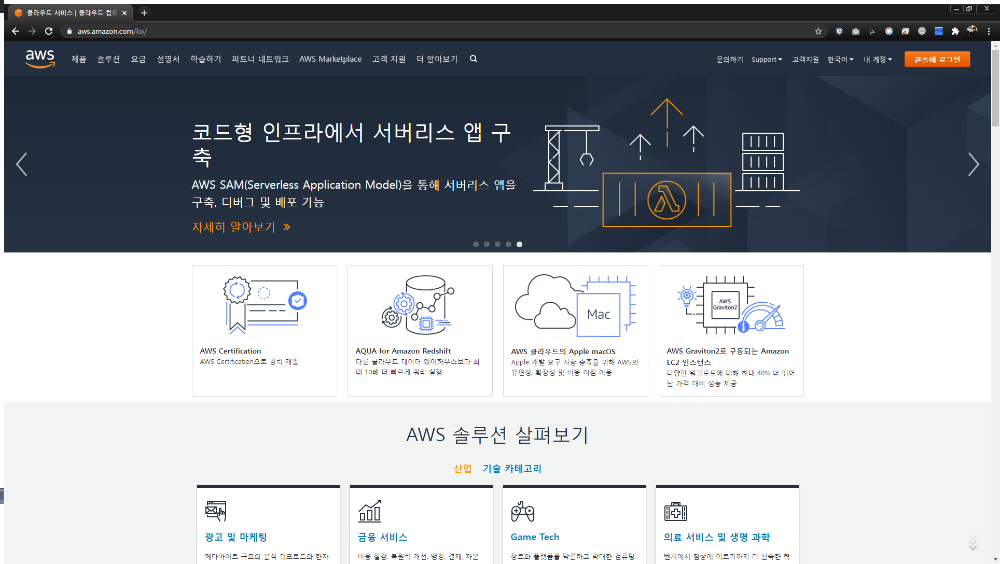

You can also put the [link URL][1] below the current paragraph
like [this][2].

   [1]: http://url
   [2]: http://another.url "A funky title"

목차
[1.개발을 하고 싶어요](#개발을-하고-싶어요)
[2.코딩을 잘하고 싶어요](#coding을-잘하고-싶어요)


## 개발을 하고 싶어요
## Coding을 잘하고 싶어요

[googlelink]: https://google.com "Go google"

***

**double asterisks**

1. 순서가 필요한 목록
1. 순서가 필요한 목록
   - 순서가 필요하지 않은 목록(서브) 
   - 순서가 필요하지 않은 목록(서브) 
1. 순서가 필요한 목록
   1. 순서가 필요한 목록(서브)
   1. 순서가 필요한 목록(서브)

값 | 의미 | 기본값
---|:---:|---:
`static` | 유형(기준) 없음 / 배치 불가능 | `static`
`relative` | 요소 **자신**을 기준으로 배치 |
`absolute` | 위치 상 **_부모_(조상)요소**를 기준으로 배치 |
`fixed` | **브라우저 창**을 기준으로 배치 |

BREAK!

> 인용문을 작성하세요!
>> 중첩된 인용문(nested blockquote)을 만들 수 있습니다.
>>> 중중첩된 인용문 1


## AWS



```
public class BootSpringBootApplication {
  public static void main(String[] args) {
    System.out.println("Hello, Honeymon");
  }s
}
```
